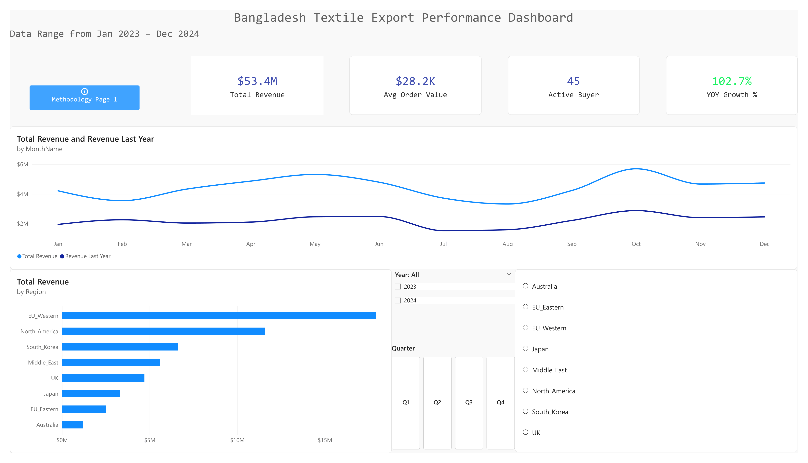
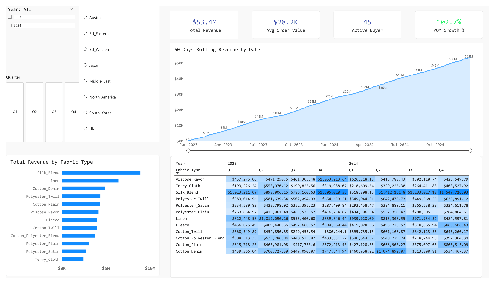
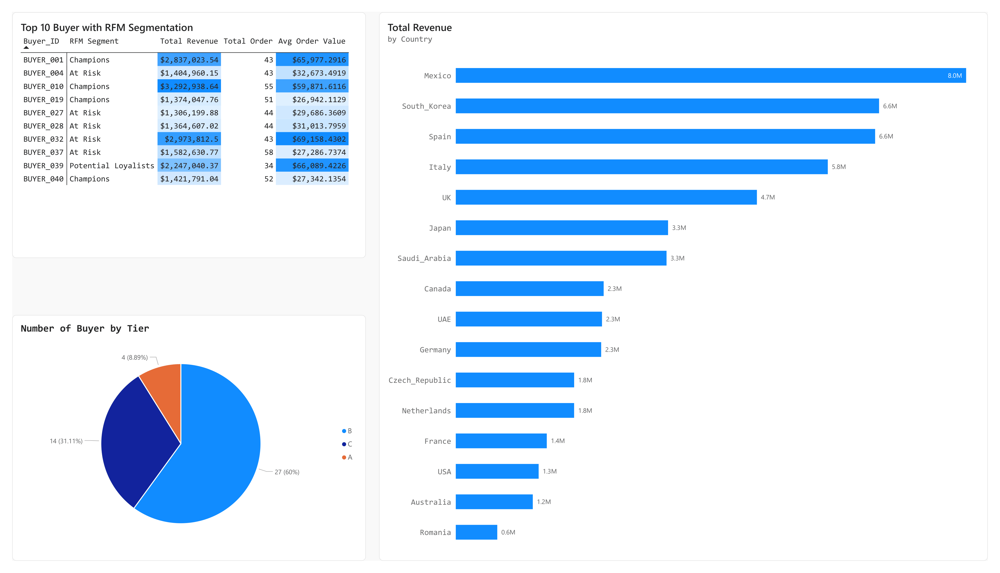
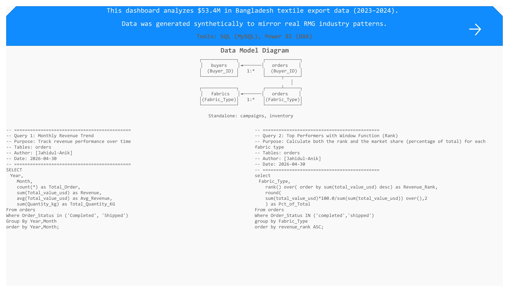
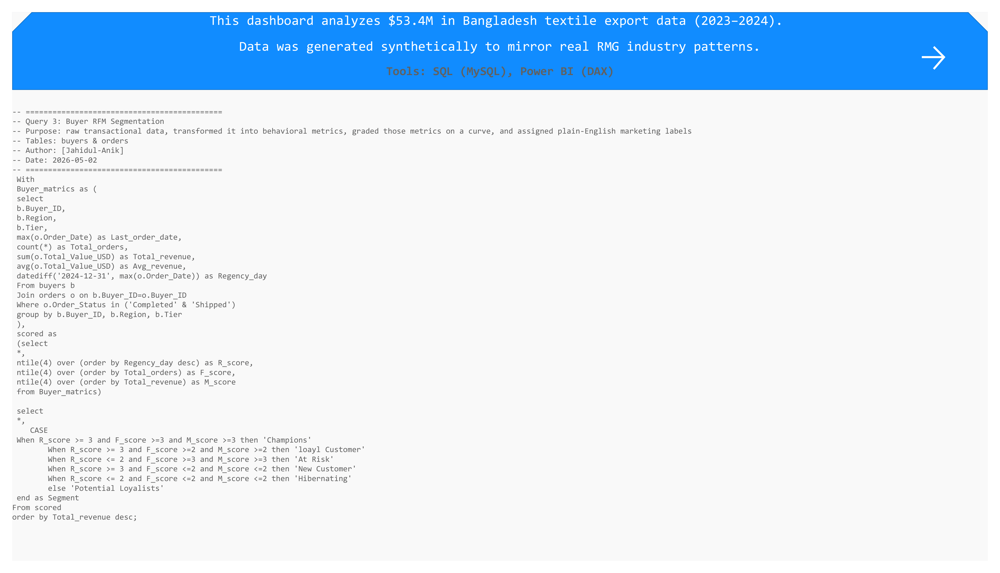
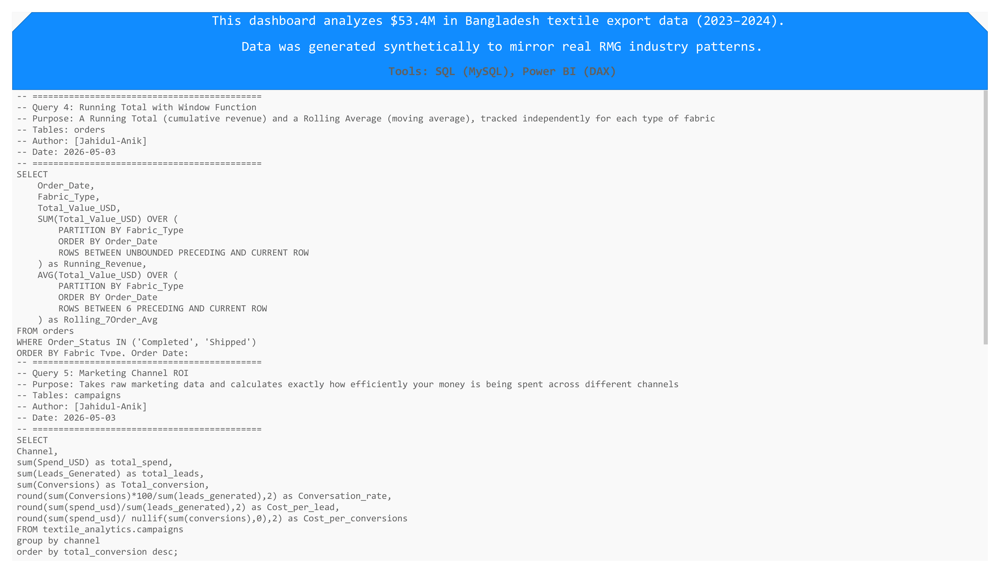

# Bangladesh Textile Export Analytics Dashboard




## Overview
Power BI and SQL dashboard analyzing **$53.4M in Bangladesh textile export data** (2023–2024) across 45 global buyers, 12 fabric types, and 8 regions. Built as a portfolio project during my transition from 8 years of professional experience in export-oriented fabric marketing into a dedicated data analytics role.

**Key Insights:** 
* Revenue grew **102.7% year-over-year** with clear seasonal demand cycles. 
* EU_Western buyers drive **35% of total revenue**.
* Silk_Blend and Linen fabrics command premium pricing and highest profit margins.

---

## Tools & Technologies
- **SQL (MySQL)** — Data extraction, window functions, CTEs, RFM segmentation
- **Power BI** — DAX measures, time intelligence, interactive dashboard design
- **Python** — Synthetic dataset generation modeling realistic industry patterns

---

## Dashboard Pages

| Page | Purpose | Key Visuals |
|------|---------|-------------|
| **Executive Summary** | Business performance overview | Revenue trend, YoY growth, regional breakdown |
| **Product Analysis** | Fabric performance & seasonality | 60-day rolling revenue, quarterly matrix, fabric ranking |
| **Buyer Insights** | Customer segmentation & behavior | Top 10 buyers, country revenue, tier distribution |
| **Methodology** | Technical documentation | SQL queries, data model, DAX measures |

---
Product Analysis Pages

Buyer Insight


## SQL Highlights

### Query 1: Monthly Revenue Trend
**Purpose:** Track revenue performance and aggregate order volume over time.

``` SQL
        SELECT
            Year,
            Month,
            COUNT(*) AS Total_Order,
            SUM(Total_value_usd) AS Revenue,
            AVG(Total_value_usd) AS Avg_Revenue,
            SUM(Quantity_kg) AS Total_Quantity_KG
        FROM orders
        WHERE Order_Status IN ('Completed', 'Shipped')
        GROUP BY Year, Month
        ORDER BY Year, Month;
```

### Query 2: Top Performers (Window Functions)
**Purpose:** Calculate both the rank and the market share (percentage of total) for each fabric type in a single pass.

```SQL
        SELECT
            Fabric_Type,
            RANK() OVER(ORDER BY SUM(total_value_usd) DESC) AS Revenue_Rank,
            ROUND( 
                SUM(total_value_usd) * 100.0 / SUM(SUM(total_value_usd)) OVER(), 2
            ) AS Pct_of_Total
        FROM orders
        WHERE Order_Status IN ('Completed', 'Shipped')
        GROUP BY Fabric_Type
        ORDER BY Revenue_Rank ASC;
```
### Query 3: Buyer RFM Segmentation (CTEs & CASE)
**Purpose:** Transform raw transactional data into behavioral metrics (Recency, Frequency, Monetary), grade them on a quartile curve, and assign marketing segments.

```SQL
        WITH Buyer_Metrics AS (
            SELECT 
                b.Buyer_ID,
                b.Region,
                b.Tier,
                MAX(o.Order_Date) AS Last_order_date,
                COUNT(*) AS Total_orders,
                SUM(o.Total_Value_USD) AS Total_revenue,
                AVG(o.Total_Value_USD) AS Avg_revenue,
                DATEDIFF('2024-12-31', MAX(o.Order_Date)) AS Recency_Days
            FROM buyers b
            JOIN orders o ON b.Buyer_ID = o.Buyer_ID
            WHERE o.Order_Status IN ('Completed', 'Shipped')
            GROUP BY b.Buyer_ID, b.Region, b.Tier
        ),
        Scored AS (
            SELECT 
                *, 
                NTILE(4) OVER (ORDER BY Recency_Days DESC) AS R_score,
                NTILE(4) OVER (ORDER BY Total_orders) AS F_score,
                NTILE(4) OVER (ORDER BY Total_revenue) AS M_score
            FROM Buyer_Metrics
        )
        SELECT
            *,
            CASE
                WHEN R_score >= 3 AND F_score >= 3 AND M_score >= 3 THEN 'Champions'
                WHEN R_score >= 3 AND F_score >= 2 AND M_score >= 2 THEN 'Loyal Customers'
                WHEN R_score <= 2 AND F_score >= 3 AND M_score >= 3 THEN 'At Risk'
                WHEN R_score >= 3 AND F_score <= 2 AND M_score <= 2 THEN 'New Customers'
                WHEN R_score <= 2 AND F_score <= 2 AND M_score <= 2 THEN 'Hibernating'
                ELSE 'Potential Loyalists'
            END AS Segment
        FROM Scored
        ORDER BY Total_revenue DESC;
```

### Query 4: Running Totals & Moving Averages
**Purpose:** Calculate a cumulative running total and a rolling 7-order average, partitioned independently for each fabric type.

```SQL
        SELECT 
            Order_Date,
            Fabric_Type,
            Total_Value_USD,
            SUM(Total_Value_USD) OVER (
                PARTITION BY Fabric_Type 
                ORDER BY Order_Date 
                ROWS BETWEEN UNBOUNDED PRECEDING AND CURRENT ROW
            ) AS Running_Revenue,
            AVG(Total_Value_USD) OVER (
                PARTITION BY Fabric_Type 
                ORDER BY Order_Date 
                ROWS BETWEEN 6 PRECEDING AND CURRENT ROW
            ) AS Rolling_7Order_Avg
        FROM orders
        WHERE Order_Status IN ('Completed', 'Shipped')
        ORDER BY Fabric_Type, Order_Date;
```
### Query 5: Marketing Channel ROI
**Purpose:** Evaluate marketing efficiency by calculating KPIs like Conversion Rate, Cost Per Lead, and Customer Acquisition Cost (CAC).

```SQL
        SELECT 
            Channel,
            SUM(Spend_USD) AS Total_Spend,
            SUM(Leads_Generated) AS Total_Leads,
            SUM(Conversions) AS Total_Conversions,
            ROUND(SUM(Conversions) * 100.0 / SUM(Leads_Generated), 2) AS Conversion_Rate,
            ROUND(SUM(Spend_USD) / SUM(Leads_Generated), 2) AS Cost_Per_Lead,
            ROUND(SUM(Spend_USD) / NULLIF(SUM(Conversions), 0), 2) AS Cost_Per_Conversion
        FROM textile_analytics.campaigns
        GROUP BY Channel
        ORDER BY Total_Conversions DESC;
```
---

## DAX Measures

| Measure | Purpose | Formula |
|---------|---------|---------|
| **Total Revenue** | Core KPI | `SUM(orders[Total_Value_USD])` |
| **Revenue YTD** | Year-to-date tracking | `TOTALYTD([Total Revenue], DateTable[Date])` |
| **Revenue Last Year** | YoY comparison base | `CALCULATE([Total Revenue], SAMEPERIODLASTYEAR(DateTable[Date]))` |
| **YoY Growth %** | Growth rate | `DIVIDE([Total Revenue] - [Revenue Last Year], [Revenue Last Year], 0)` |
| **60-Day Rolling Revenue** | Smooth short-term noise | `CALCULATE([Total Revenue], DATESINPERIOD(DateTable[Date], MAX(DateTable[Date]), -60, DAY))` |
| **Active Buyers** | Customer count | `DISTINCTCOUNT(orders[Buyer_ID])` |

---

## Dataset

Synthetic data modeling real Bangladesh RMG industry patterns:

| Metric | Value |
|--------|-------|
| **Total Orders** | 1,892 |
| **Total Revenue** | $53.4M |
| **Buyers** | 45 across 8 regions |
| **Fabric Types** | 12 (cotton, polyester, blends, knits) |
| **Date Range** | January 2023 – December 2024 |
| **Campaigns** | 20 across 6 channels |
| **Inventory Records** | 288 monthly snapshots |

---

## Methodology Pages

Technical documentation showing SQL queries, data model diagrams, and DAX validation logic:





---

## About Me

8 years in Bangladesh fabric marketing, now transitioning to data analytics. Self-taught SQL and Power BI while working full-time. This project demonstrates my ability to combine **domain expertise** (textile supply chains, B2B buyer behavior) with **technical skills** (SQL, DAX, data modeling).

**Seeking:** Remote data analyst roles in textile, e-commerce, fashion, or B2B sectors.

**Contact:** [LinkedIn](www.linkedin.com/in/jahidul-anik) | [Email](jahidul-anik@outlook.com)

---

## License
This project is for portfolio demonstration. Dataset is synthetic.
